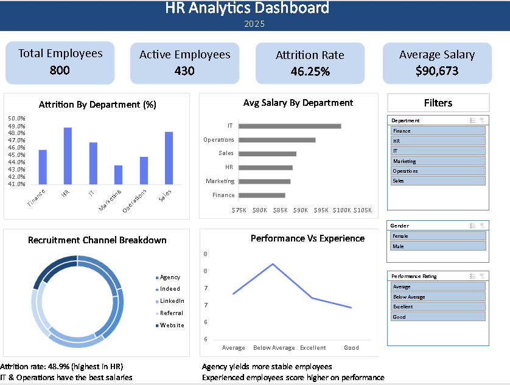

# 👩‍💼 HR Analytics Dashboard (Excel)

This project is an interactive HR Analytics Dashboard built in Microsoft Excel to monitor workforce performance, attrition, salary distribution, and recruitment trends.

---

## 🚀 Key Highlights

- 800+ employee records analyzed  
- KPIs: Total Employees, Active Employees, Attrition Rate, Average Salary  
- Interactive slicers for Department, Gender, and Performance Rating  
- Visual insights for Attrition %, Salary by Department, Recruitment Channels, and Performance vs Experience  
- Built entirely using PivotTables, PivotCharts, and Excel formulas  

---

## 🧠 Business Insights

- **Overall Attrition Rate:** 46.25% (highest in HR department)  
- **IT & Operations** have the highest average salaries  
- Employees recruited via **Agencies** show better retention  
- **Experienced employees** tend to perform better  

---

## 📂 Files Included

| File | Description |
|------|--------------|
| `HR_Analytics_Dashboard.xlsx` | Final Excel dashboard |
| `HR_Analytics_Dataset.xlsx` | Dataset used for analysis |
| `Dashboard_Screenshot.png` | Dashboard preview image |

---

## 🖼️ Dashboard Preview

---

## 🛠️ Tools Used

- Microsoft Excel  
- PivotTables & PivotCharts  
- Slicers & Filters  
- Conditional Formatting  
- Excel Formulas  

---

## 📌 Project Purpose

This project demonstrates:
- HR data analytics & KPI tracking  
- Excel dashboard design & visualization  
- Data storytelling through business insights  

Perfect for showcasing **Excel BI and Data Analyst skills**.

---

## 👩‍💻 Author

**Rakshita Mahar**  
📧 maharrakshita1@gmail.com 
🔗 https://www.linkedin.com/in/rakshita-mahar-bb7b65201?utm_source=share&utm_campaign=share_via&utm_content=profile&utm_medium=android_app  

---

⭐ *If you found this useful, please give it a star on GitHub!*
